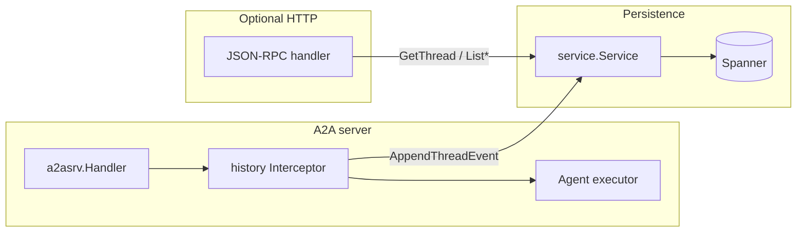

# A2A HISTORY GO SDK

[](LICENSE)

This project contains a lightweight Go library for developers supporting the [a2a-history](spec.md) A2A extension.

## Features

- **Integration with the official [A2A Go SDK](https://github.com/a2aproject/a2a-go/tree/main):** Builds on top of the official library for building A2A-compliant agents in Go.
- **Extensible:** Add or swap database backends by implementing [`service.Service`](service/service.go).
- **Two integration points:** A [`srv`](srv/) **call interceptor** (records traffic as your agent runs) and an optional **JSON-RPC** HTTP handler for querying history from clients.

## Packages

| Package                                                   | Role                                                                                                                                                                                                                                                                                         |
| --------------------------------------------------------- | -------------------------------------------------------------------------------------------------------------------------------------------------------------------------------------------------------------------------------------------------------------------------------------------- |
| [`go.alis.build/a2a/extension/history/service`](service/) | [`Service`](service/service.go) interface and [`SpannerService`](service/spanner.go) (Google Cloud Spanner + IAM).                                                                                                                                                                           |
| [`go.alis.build/a2a/extension/history/srv`](srv/)         | [`NewInterceptor`](srv/interceptor.go) ([`a2asrv.CallInterceptor`](https://pkg.go.dev/github.com/a2aproject/a2a-go/v2/a2asrv#CallInterceptor)), [`NewJSONRPCHandler`](srv/jsonrpc.go) with options such as [`WithCORS`](srv/cors.go), A2A→proto conversions ([`pbconv.go`](srv/pbconv.go)), JSON-RPC errors ([`errors.go`](srv/errors.go)). |

Package-level documentation (design, IAM roles, interceptor flow) lives in [`service/docs.go`](service/docs.go) and [`srv/docs.go`](srv/docs.go). Run `go doc -all ./...` locally for the full commentary.

## Architecture (high level)



1. **Interceptor path:** On each RPC, `Before` activates the history extension when the client requested it, converts `SendMessage` payloads to `ThreadEvent`s, and either appends immediately or defers until `After` has a `ContextID` from the response. `After` appends response-shaped events (task, message, status, artifact updates) and may append twice when a deferred user message is flushed first.
2. **JSON-RPC path:** Browsers or tools call `GetThread`, `ListThreads`, `ListThreadEvents` over JSON-RPC 2.0 POST; the same `Service` backs reads. Params and `result` use **protojson** (camelCase JSON; unknown fields are ignored on decode). Errors returned by the service as **gRPC statuses** are mapped to JSON-RPC error codes (for example `InvalidArgument` → invalid params, `NotFound` → not found). For cross-origin browsers, register the handler with `srv.WithCORS()` (or tailored `CORSAllow*` options).

## Installation

```bash
go get -u go.alis.build/a2a/extension/history
```

## Getting started

### History service

For full control over storage, implement [`service.Service`](service/service.go):

```go
type Service interface {
	GetThread(ctx context.Context, req *v1.GetThreadRequest) (*v1.Thread, error)
	ListThreads(ctx context.Context, req *v1.ListThreadsRequest) (*v1.ListThreadsResponse, error)
	ListThreadEvents(ctx context.Context, req *v1.ListThreadEventsRequest) (*v1.ListThreadEventsResponse, error)
	AppendThreadEvent(ctx context.Context, req *v1.AppendThreadEventRequest) (*v1.AppendThreadEventResponse, error)
}
```

Alternatively, use the built-in Spanner implementation:

```go
import (
	"go.alis.build/a2a/extension/history/service"
)

historyService, err := service.NewSpannerService(ctx, &service.SpannerStoreConfig{
	Project:      "SPANNER_PROJECT_NAME",
	Instance:     "SPANNER_INSTANCE_NAME",
	Database:     "SPANNER_DATABASE_NAME",
	ThreadsTable: "THREADS_TABLE_NAME",
	EventsTable:  "EVENTS_TABLE_NAME",
})
```

Below is Terraform aligned with `SpannerService` expectations (proto columns, foreign key).

```hcl
resource "alis_google_spanner_table" "a2a_thread" {
  project         = "SPANNER_PROJECT_NAME"
  instance        = "SPANNER_INSTANCE_NAME"
  database        = "SPANNER_DATABASE_NAME"
  name            = "THREADS_TABLE_NAME"
  schema = {
    columns = [
      {
        name           = "key",
        type           = "STRING",
        is_primary_key = true,
        required       = true
      },
      {
        name          = "Thread",
        type          = "PROTO"
        proto_package = "alis.a2a.extension.history.v1.Thread"
        required      = true
      },
      {
        name          = "Policy",
        type          = "PROTO"
        proto_package = "google.iam.v1.Policy"
        required      = true
      },
      {
        name            = "create_time",
        type            = "TIMESTAMP",
        required        = false,
        is_computed     = true,
        computation_ddl = "TIMESTAMP_ADD(TIMESTAMP_SECONDS(Thread.create_time.seconds),INTERVAL CAST(FLOOR(Thread.create_time.nanos / 1000) AS INT64) MICROSECOND)",
        is_stored       = true
      },
    ]
  }
}

resource "alis_google_spanner_table" "a2a_thread_events" {
  project         = "SPANNER_PROJECT_NAME"
  instance        = "SPANNER_INSTANCE_NAME"
  database        = "SPANNER_DATABASE_NAME"
  name            = "EVENTS_TABLE_NAME"
  schema = {
    columns = [
      {
        name           = "key",
        type           = "STRING",
        is_primary_key = true,
        required       = true
      },
      {
        name          = "Event",
        type          = "PROTO"
        proto_package = "alis.a2a.extension.history.v1.ThreadEvent"
        required      = true
      },
      {
        name           = "thread",
        type           = "STRING",
        required       = false
        is_stored      = true
        is_computed    = true
        computation_ddl = "REGEXP_EXTRACT(Event.name, r'^(threads/[^/]+)')",
      },
      {
        name            = "create_time",
        type            = "TIMESTAMP",
        required        = false,
        is_computed     = true,
        computation_ddl = "TIMESTAMP_ADD(TIMESTAMP_SECONDS(Event.create_time.seconds),INTERVAL CAST(FLOOR(Event.create_time.nanos / 1000) AS INT64) MICROSECOND)",
        is_stored       = true
      },
    ]
  }
}

resource "alis_google_spanner_table_foreign_key" "a2a_thread_events_fk" {
  project           = "SPANNER_PROJECT_NAME"
  instance          = "SPANNER_INSTANCE_NAME"
  database          = "SPANNER_DATABASE_NAME"
  name              = "EVENT_FOREIGN_KEY_NAME"
  table             = "EVENTS_TABLE_NAME"
  column            = "thread"
  referenced_table  = alis_google_spanner_table.a2a_thread.name
  referenced_column = "key"
  on_delete         = "CASCADE"
}
```

### Registering the call interceptor

Wire the interceptor into the A2A request handler so history is recorded as the executor runs:

```go
import (
	"github.com/a2aproject/a2a-go/v2/a2asrv"
	"go.alis.build/a2a/extension/history/srv"
)

requestHandler := a2asrv.NewHandler(
	&agentExecutor{},
	// ... other options ...
	a2asrv.WithCallInterceptor(srv.NewInterceptor(historyService, srv.WithAgentID("my-agent-id"))),
)
```

With a custom `Service` implementation:

```go
var myCustomService service.Service = &MyCustomHistoryService{}

requestHandler := a2asrv.NewHandler(
	&agentExecutor{},
	a2asrv.WithCallInterceptor(srv.NewInterceptor(myCustomService)),
)
```

### JSON-RPC handler (optional)

Expose history reads over HTTP with [`srv.NewJSONRPCHandler`](srv/jsonrpc.go). The handler accepts optional functional options (`...srv.JSONRPCHandlerOption`). Mount it at [`srv.HistoryExtensionPath`](srv/jsonrpc.go) or any path your gateway uses. Wire format: JSON-RPC 2.0 with protobuf messages in `params` / `result` via **protojson**; service errors that are gRPC statuses are translated to JSON-RPC errors (see [`srv/errors.go`](srv/errors.go) for codes such as [`ErrNotFound`](srv/errors.go), [`ErrInvalidParams`](srv/errors.go)).

Same-origin or non-browser clients (no CORS):

```go
import "go.alis.build/a2a/extension/history/srv"

mux.Handle(srv.HistoryExtensionPath, srv.NewJSONRPCHandler(historyService))
```

Browser clients crossing origins need CORS on the JSON-RPC responses and an OPTIONS preflight. Pass [`srv.WithCORS`](srv/cors.go) (defaults: `Access-Control-Allow-Origin: *`, `POST` and `OPTIONS`, and common `Content-Type` / `Authorization` / Alis `X-Alis-*` headers):

```go
mux.Handle(srv.HistoryExtensionPath, srv.NewJSONRPCHandler(historyService, srv.WithCORS()))
```

Override origin or allowed headers/methods with [`srv.CORSAllowOrigin`](srv/cors.go), [`srv.CORSAllowHeaders`](srv/cors.go), and [`srv.CORSAllowMethods`](srv/cors.go):

```go
mux.Handle(srv.HistoryExtensionPath, srv.NewJSONRPCHandler(historyService,
	srv.WithCORS(
		srv.CORSAllowOrigin("https://app.example.com"),
		srv.CORSAllowHeaders("Content-Type", "Authorization"),
		srv.CORSAllowMethods("POST", "OPTIONS"),
	),
))
```

## Documentation

- See [`service/docs.go`](service/docs.go) and [`srv/docs.go`](srv/docs.go) for method-level flows, IAM roles, and interceptor semantics.
- Proto definitions: `alis/a2a/extension/history/v1` in this module.
