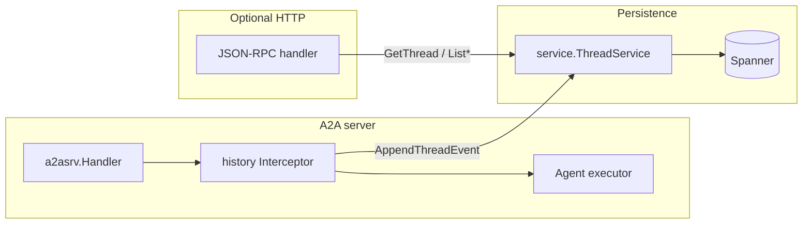

# A2A HISTORY GO SDK



[](LICENSE)

This project contains a lightweight Go library for developers supporting the [a2a-history](spec.md) A2A extension.

## Features

- **Integration with the official [A2A Go SDK](https://github.com/a2aproject/a2a-go/tree/main):** Builds on top of the official library for building A2A-compliant agents in Go.
- **Built-in persistence:** Includes a Google Cloud Spanner-backed [`service.ThreadService`](service/thread.go).
- **Two integration points:** An [`a2asrv`](a2asrv/) call interceptor (records traffic as your agent runs) and an optional [`jsonrpc`](jsonrpc/) HTTP handler for querying history from clients.
- **Infra module alignment:** The built-in storage model matches the Terraform module consumed from `alis/build/ge/agent/v2/infra/modules/alis.a2a.extension.history.v1`.

## Packages

| Package                                                   | Role                                                                                                                                                                                                                                                                                         |
| --------------------------------------------------------- | -------------------------------------------------------------------------------------------------------------------------------------------------------------------------------------------------------------------------------------------------------------------------------------------- |
| [`go.alis.build/a2a/extension/history/service`](service/) | [`ThreadService`](service/thread.go) and [`NewThreadService`](service/thread.go) for the built-in Google Cloud Spanner + IAM implementation.                                                                                                                                                 |
| [`go.alis.build/a2a/extension/history/a2asrv`](a2asrv/)   | [`NewInterceptor`](a2asrv/interceptor.go) ([`a2asrv.CallInterceptor`](https://pkg.go.dev/github.com/a2aproject/a2a-go/v2/a2asrv#CallInterceptor)) and A2A-to-proto conversion helpers ([`pbconv.go`](a2asrv/pbconv.go)).                                                                |
| [`go.alis.build/a2a/extension/history/jsonrpc`](jsonrpc/) | [`NewJSONRPCHandler`](jsonrpc/jsonrpc.go) with options such as [`WithCORS`](jsonrpc/cors.go), plus JSON-RPC error mapping ([`errors.go`](jsonrpc/errors.go)).                                                                                                                               |

Package-level documentation (design, IAM roles, interceptor flow) lives in [`service/docs.go`](service/docs.go), [`a2asrv/docs.go`](a2asrv/docs.go), and [`jsonrpc/docs.go`](jsonrpc/docs.go). Run `go doc -all ./...` locally for the full commentary.

## Infra Layout

The history extension is intended to plug into the agent infra layout under `alis/build/ge/agent/v2/infra`:

```text
alis/build/ge/agent/v2/infra/
├── main.tf
├── cloudrun.tf
├── spanner.tf
└── modules/
    ├── alis.adk.sessions.v1/
    ├── alis.a2a.extension.history.v1/
    │   └── main.tf
    └── alis.a2a.extension.scheduler.v1/
```

- `infra/main.tf` wires the history module alongside the sessions and scheduler modules.
- `infra/modules/alis.a2a.extension.history.v1/main.tf` creates the `Threads`, `ThreadEvents`, and `UserThreadStates` Spanner tables plus the foreign keys expected by [`service.ThreadService`](service/thread.go).
- The module derives table names as `${replace(var.ALIS_OS_PROJECT, "-", "_")}_${replace(var.neuron, "-", "_")}_Threads`, `_ThreadEvents`, and `_UserThreadStates`.
- `infra/cloudrun.tf` passes the managed Spanner project, instance, and database into the agent container through `ALIS_MANAGED_SPANNER_*` environment variables.

## Architecture (high level)



1. **Interceptor path:** On each RPC, `Before` activates the history extension when the client requested it, converts `SendMessage` payloads to `ThreadEvent`s, and either appends immediately or defers until `After` has a `ContextID` from the response. `After` appends response-shaped events (task, message, status, artifact updates) and may append twice when a deferred user message is flushed first.
2. **Storage semantics:** `AppendThreadEvent` assigns every event a unique monotonic `sequence` within its thread and updates shared thread state atomically (`next_sequence`, `latest_sequence`). `ListThreads` returns caller-scoped `ThreadView` projections by joining `Thread` rows with per-user `UserThreadState` rows (`read_sequence`, `pinned`, `pinned_time`).
3. **JSON-RPC path:** Browsers or tools call `GetThread`, `ListThreads`, `ListThreadEvents` over JSON-RPC 2.0 POST; the same `ThreadService` backs reads. Params and `result` use **protojson** (camelCase JSON; unknown fields are ignored on decode). Errors returned by the service as **gRPC statuses** are mapped to JSON-RPC error codes (for example `InvalidArgument` → invalid params, `NotFound` → not found). For cross-origin browsers, register the handler with `jsonrpc.WithCORS()` (or tailored `CORSAllow*` options).

## Installation

```bash
go get -u go.alis.build/a2a/extension/history
```

## Getting started

### History service

Use the built-in Spanner-backed `ThreadService`. In the `ge/agent/v2/infra` layout, the Cloud Run agent container receives the backing Spanner coordinates from `infra/cloudrun.tf` via `ALIS_MANAGED_SPANNER_PROJECT`, `ALIS_MANAGED_SPANNER_INSTANCE`, and `ALIS_MANAGED_SPANNER_DB`.

```go
import (
	"fmt"
	"os"

	"go.alis.build/a2a/extension/history/service"
)

project := os.Getenv("ALIS_MANAGED_SPANNER_PROJECT")
instance := os.Getenv("ALIS_MANAGED_SPANNER_INSTANCE")
database := os.Getenv("ALIS_MANAGED_SPANNER_DB")
prefix := fmt.Sprintf("%s_%s", "my_os_project", "my_neuron")

historyService, err := service.NewThreadService(ctx, &service.SpannerStoreConfig{
	Project:               project,
	Instance:              instance,
	Database:              database,
	ThreadsTable:          prefix + "_Threads",
	EventsTable:           prefix + "_ThreadEvents",
	UserThreadStatesTable: prefix + "_UserThreadStates",
})
```

In the managed infra layout, `prefix` must match the Terraform module naming rule:
`${replace(var.ALIS_OS_PROJECT, "-", "_")}_${replace(var.neuron, "-", "_")}`.

Register it on your gRPC server without importing the generated history proto package:

```go
grpcServer := grpc.NewServer()
historyService.Register(grpcServer)
```

If you are deploying through `alis/build/ge/agent/v2/infra`, register the history schema from `infra/main.tf` by including the module:

```hcl
module "alis_a2a_extension_history_v1" {
  source = "./modules/alis.a2a.extension.history.v1"

  alis_os_project               = var.ALIS_OS_PROJECT
  alis_managed_spanner_project  = var.ALIS_MANAGED_SPANNER_PROJECT
  alis_managed_spanner_instance = var.ALIS_MANAGED_SPANNER_INSTANCE
  alis_managed_spanner_db       = var.ALIS_MANAGED_SPANNER_DB
  neuron                        = local.neuron

  depends_on = [google_project_service.environment]
}
```

That module currently owns the full history schema:

- `Threads`: `Thread` proto payload, IAM `Policy`, computed `create_time`
- `ThreadEvents`: `ThreadEvent` proto payload, computed `thread`, computed `create_time`
- `UserThreadStates`: `UserThreadState` proto payload, computed `thread`, computed `user`, computed `update_time`
- Foreign keys from `ThreadEvents.thread` and `UserThreadStates.thread` back to `Threads.key`

If you are not using the `ge/agent/v2/infra` layout, your custom Terraform must still reproduce the same columns and foreign keys because [`service.ThreadService`](service/thread.go) assumes that schema.

### Registering the call interceptor

Wire the interceptor into the A2A request handler so history is recorded as the executor runs:

```go
import (
	sdka2asrv "github.com/a2aproject/a2a-go/v2/a2asrv"
	historya2asrv "go.alis.build/a2a/extension/history/a2asrv"
)

requestHandler := sdka2asrv.NewHandler(
	&agentExecutor{},
	// ... other options ...
	sdka2asrv.WithCallInterceptor(historya2asrv.NewInterceptor(historyService, historya2asrv.WithAgentID("my-agent-id"))),
)
```

### JSON-RPC handler (optional)

Expose history reads over HTTP with [`jsonrpc.NewJSONRPCHandler`](jsonrpc/jsonrpc.go). The handler accepts optional functional options (`...jsonrpc.JSONRPCHandlerOption`). Mount it at [`jsonrpc.HistoryExtensionPath`](jsonrpc/jsonrpc.go) or any path your gateway uses. Wire format: JSON-RPC 2.0 with protobuf messages in `params` / `result` via **protojson**; service errors that are gRPC statuses are translated to JSON-RPC errors (see [`jsonrpc/errors.go`](jsonrpc/errors.go) for codes such as [`ErrNotFound`](jsonrpc/errors.go), [`ErrInvalidParams`](jsonrpc/errors.go)).

Same-origin or non-browser clients (no CORS):

```go
import "go.alis.build/a2a/extension/history/jsonrpc"

mux.Handle(jsonrpc.HistoryExtensionPath, jsonrpc.NewJSONRPCHandler(historyService))
```

If you use a method-aware mux such as Go 1.22+ `http.ServeMux`, you can let the package mount the
history endpoint for you:

```go
jsonrpc.Register(mux, historyService)
```

Browser clients crossing origins need CORS on the JSON-RPC responses and an OPTIONS preflight. Pass [`jsonrpc.WithCORS`](jsonrpc/cors.go) (defaults: `Access-Control-Allow-Origin: *`, `POST` and `OPTIONS`, and common `Content-Type` / `Authorization` / Alis `X-Alis-*` headers):

```go
mux.Handle(jsonrpc.HistoryExtensionPath, jsonrpc.NewJSONRPCHandler(historyService, jsonrpc.WithCORS()))
```

With a method-aware mux, the helper can register the same endpoint with CORS enabled:

```go
jsonrpc.Register(mux, historyService, jsonrpc.WithCORS())
```

Override origin or allowed headers/methods with [`jsonrpc.CORSAllowOrigin`](jsonrpc/cors.go), [`jsonrpc.CORSAllowHeaders`](jsonrpc/cors.go), and [`jsonrpc.CORSAllowMethods`](jsonrpc/cors.go):

```go
mux.Handle(jsonrpc.HistoryExtensionPath, jsonrpc.NewJSONRPCHandler(historyService,
	jsonrpc.WithCORS(
		jsonrpc.CORSAllowOrigin("https://app.example.com"),
		jsonrpc.CORSAllowHeaders("Content-Type", "Authorization"),
		jsonrpc.CORSAllowMethods("POST", "OPTIONS"),
	),
))
```

## Documentation

- See [`service/docs.go`](service/docs.go), [`a2asrv/docs.go`](a2asrv/docs.go), and [`jsonrpc/docs.go`](jsonrpc/docs.go) for method-level flows, IAM roles, and transport semantics.
- Infra consumers should treat `alis/build/ge/agent/v2/infra/main.tf` as the integration point and `alis/build/ge/agent/v2/infra/modules/alis.a2a.extension.history.v1/main.tf` as the source of truth for the storage layout.
- Reader/pin state lives in per-user `UserThreadState` rows. `ListThreads` returns `ThreadView` objects that derive `has_unread` from `Thread.latest_sequence` and the caller's `UserThreadState.read_sequence`.
- `ThreadEvent.sequence` is a stable per-thread cursor assigned by the service during `AppendThreadEvent`.
- Proto definitions: `alis/a2a/extension/history/v1` in this module.
